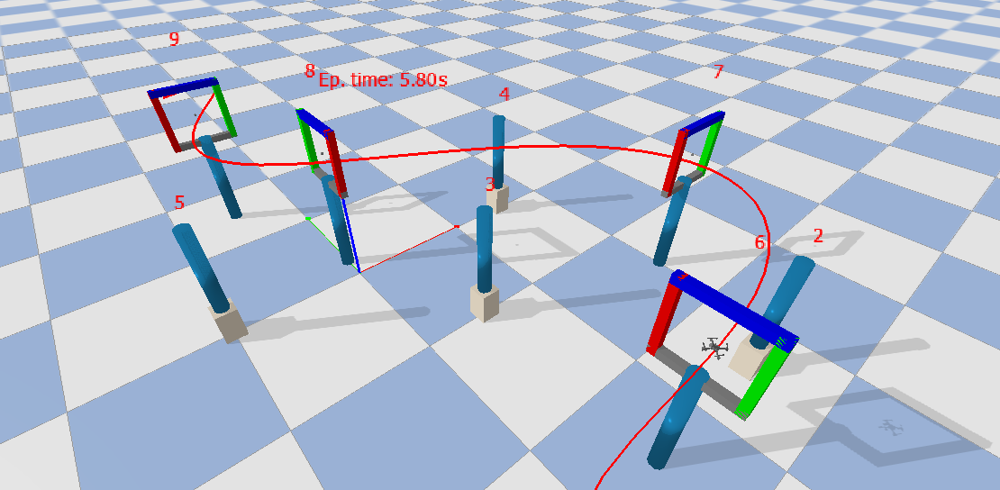

# AER1217 Final Project



## Description
[Drone racing](https://thedroneracingleague.com/) has become a popular sport in which professional human pilots fly small quadrotors through complex tracks at high speeds. Combining cutting-edge robotics technology and high-speed competition, drone racing is creating a new era of sports in the physical world, virtual environments, and the metaverse. Human pilots undergo years of training to master the sensorimotor skills involved in drone racing competitions. Today, robotics researchers are developing autonomous algorithms to achieve or even outperform expert human pilots in racing competitions. A key challenge is planning a time-optimal trajectory to complete the task while satisfying certain constraints. In the final project, we will hold an autonomous drone racing competition, which emphasizes the motion planning problem in robotics. 

The final project includes two phases:
- **In the first phase**, you are given a [Pybullet](https://pybullet.org/wordpress/) simulation environment to develop the algorithm. The task is to design a planning algorithm to navigate, as fast as possible, through the four gates and reach the target point while avoiding obstacles. The sequence of the gates will be provided during the project demonstration day. In the simulation, we provide accurate pose measurements of the quadrotor, positions of the gates, interfaces to a low-level controller, and noisy positions of the obstacles. You are required to show that the proposed algorithm can safely navigate the quadrotor through the gates while dealing with the uncertainties of the obstacles. 

- **In the second phase**, we will execute the algorithm you developed in a real-world experimental setup. We will check if the proposed algorithm can navigate safely to the target point and the amount of time it takes to complete the task. 

## Install on Ubuntu

We recommend Ubuntu 20.04 on a mid-tier laptop and GPU (e.g., a Lenovo P52 with i7-8850H/Quadro P2000)

```bash
git clone https://github.com/utiasDSL/safe-control-gym.git
cd safe-control-gym
git checkout aer1217-course-project
```

Create and access a Python 3.8 environment using
[`conda`](https://docs.conda.io/projects/conda/en/latest/user-guide/install/index.html)

```bash
conda create -n aer1217-project python=3.8
conda activate aer1217-project
```

Install the `safe-control-gym` repository

```bash
pip install --upgrade pip
pip install -e .
```

## Install `pycffirmware`

```bash
cd ..
git clone https://github.com/utiasDSL/pycffirmware.git
cd pycffirmware/
git submodule update --init --recursive
sudo apt update
sudo apt -y install swig
sudo apt install build-essential
cd wrapper/
chmod +x build_linux.sh
./build_linux.sh
```

## Getting Started

Run the scripts in [`aer-course-project/`](https://github.com/utiasDSL/safe-control-gym/tree/aer1217-course-project/aer-course-project)

```bash
cd ../../safe-control-gym/aer-course-project/
python3 final_project.py --overrides ./getting_started.yaml
```

**Modify file [`edit_this.py`](https://github.com/utiasDSL/safe-control-gym/blob/beta-iros-competition/competition/edit_this.py) to customize your controller based on [Crazyswarm's Crazyflie interface](https://crazyswarm.readthedocs.io/en/latest/api.html#pycrazyswarm.crazyflie.Crazyflie)**

-----
> University of Toronto's [Dynamic Systems Lab](https://github.com/utiasDSL) / [Vector Institute for Artificial Intelligence](https://github.com/VectorInstitute)
