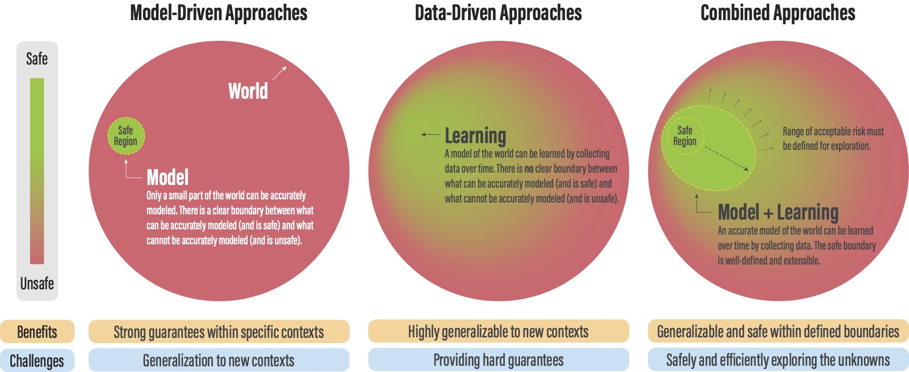
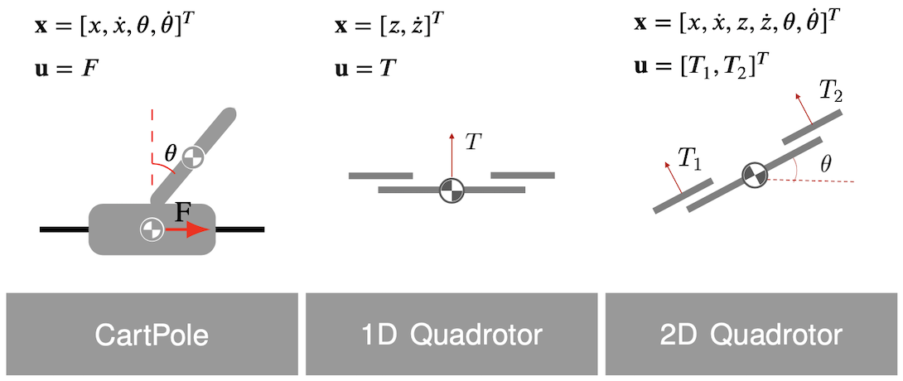
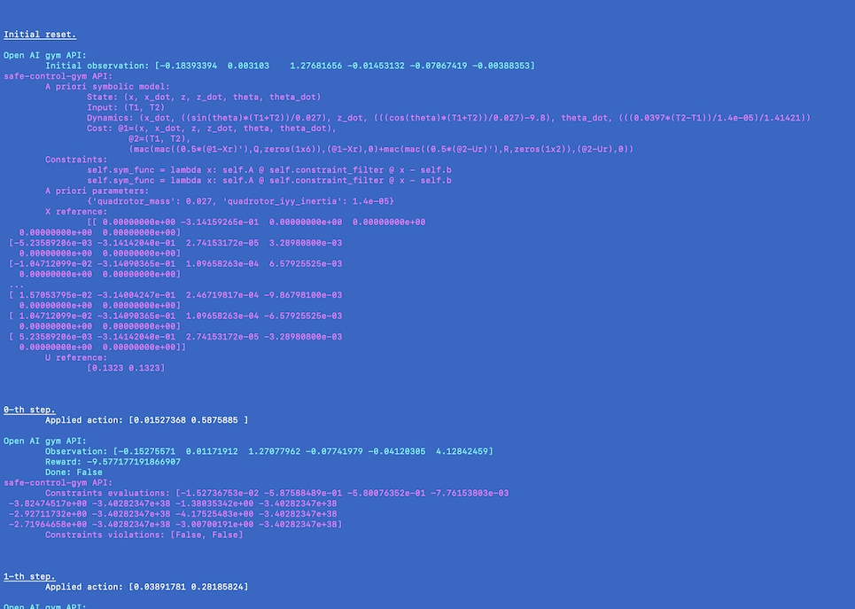
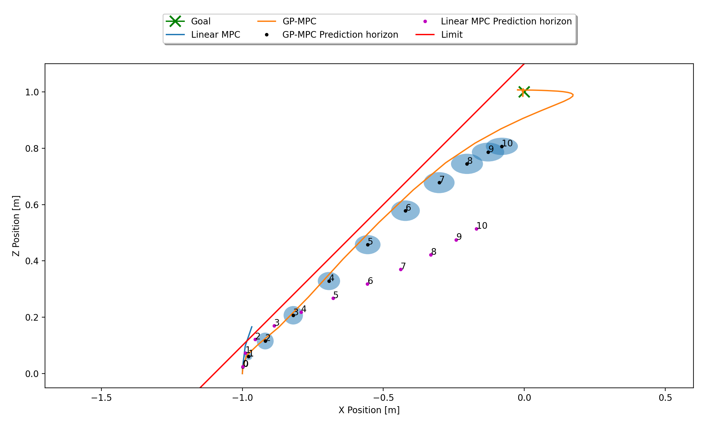
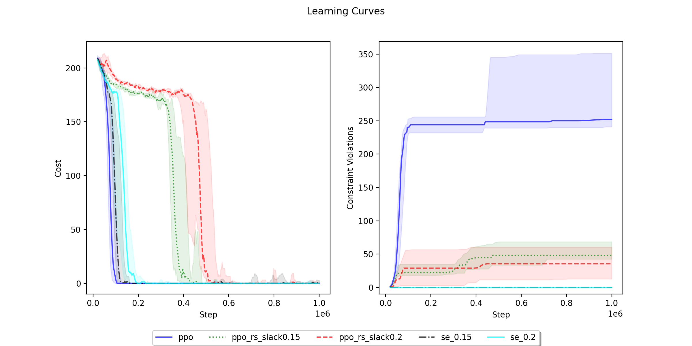
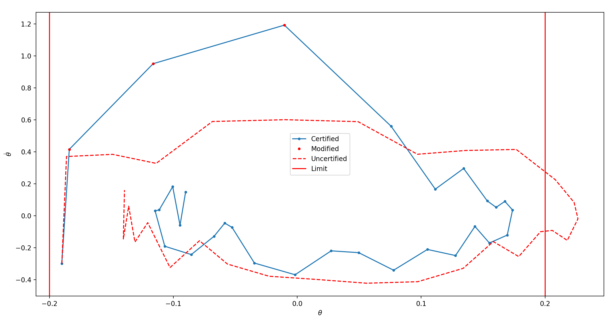
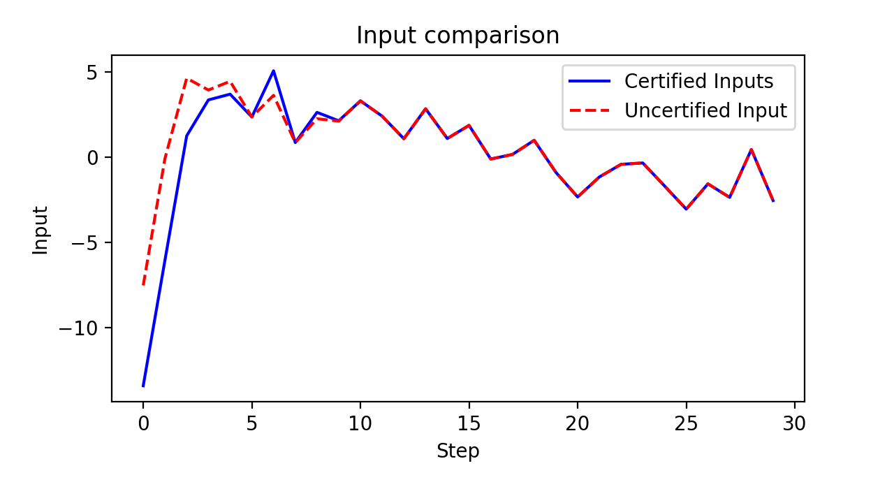
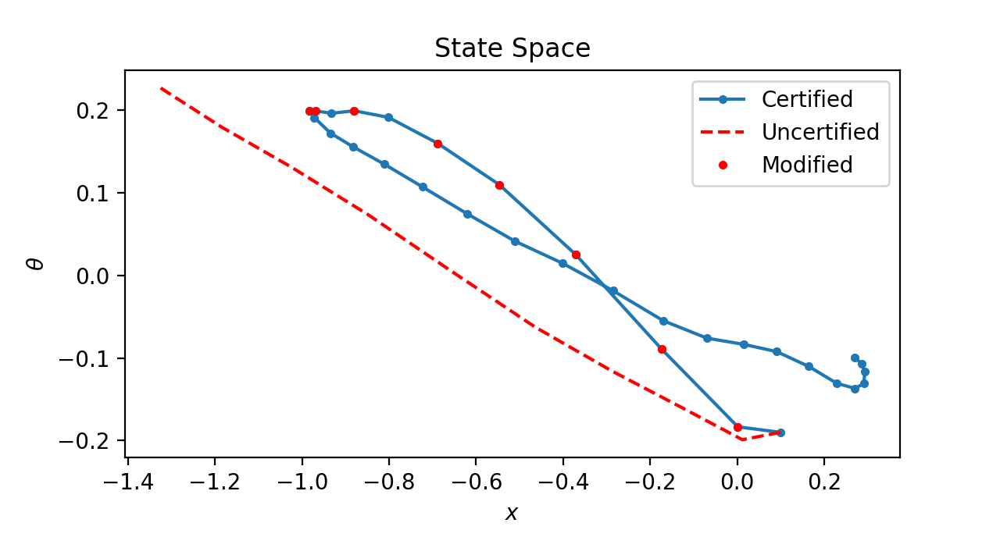

# safe-control-gym


Physics-based CartPole and Quadrotor [Gym](https://gym.openai.com) environments (using [PyBullet](https://pybullet.org/wordpress/)) with symbolic *a priori* dynamics (using [CasADi](https://web.casadi.org)) for **learning-based control**, and model-free and model-based **reinforcement learning** (RL). 

These environments include (and evaluate) symbolic safety constraints and implement input, parameter, and dynamics disturbances to test the robustness and generalizability of control approaches. [[PDF]](https://arxiv.org/pdf/2108.06266.pdf)



```
@article{brunke2021safe,
  title={Safe Learning in Robotics: From Learning-Based Control to Safe Reinforcement Learning}, 
  author={Lukas Brunke and Melissa Greeff and Adam W. Hall and Zhaocong Yuan and Siqi Zhou and Jacopo Panerati and Angela P. Schoellig},
  journal = {Annual Review of Control, Robotics, and Autonomous Systems},
  year={2021},
  url = {https://arxiv.org/abs/2108.06266}}
```


## Install on Ubuntu/macOS
(optional) Create and access a Python 3.7 environment using [`conda`](https://docs.conda.io/projects/conda/en/latest/user-guide/install/index.html)
```
$ conda create -n safe python=3.7                                  # Create environment (named 'safe' here)
$ conda activate safe                                              # Activate environment 'safe'
```
Clone and install the `safe-control-gym` repository 
```
$ git clone -b ar https://github.com/utiasDSL/safe-control-gym.git # Clone repository (the 'ar' branch specifically)
$ cd safe-control-gym                                              # Enter the repository
$ pip install -e .                                                 # Install the repository
```


## Architecture

Overview of `safe-control-gym`'s API:


## Getting Started
Familiarize with APIs and environments with the scripts in [`examples/`](https://github.com/utiasDSL/safe-control-gym/tree/main/examples)
```
$ cd ./examples/                                                   # Navigate to the examples folder
$ python3 tracking.py  --overrides tracking.yaml                   # PID trajectory tracking with the 2D quadcopter
$ python3 verbose_api.py --system cartpole --overrides verbose_api.yams  #  Printout of the extened safe-control-gym APIs
```


## Systems Variables and 2D Quadrotor Lemniscate Trajectory Tracking

 


## Verbose API Example




## List of Implemented Controllers

- LQR [coming soon]
- iLQR [coming soon]
- Linear MPC
- GP-MPC
- SAC
- PPO
- Safety Layer
- RARL [coming soon]
- RAP [coming soon]
- MPSC
- CBF [coming soon]


## Re-create the Results in "Safe Learning in Robotics" [[arXiv link]](https://arxiv.org/pdf/2108.06266.pdf)

**[Branch `ar`](https://github.com/utiasDSL/safe-control-gym/tree/ar) (or [release `v0.5.0`](https://github.com/utiasDSL/safe-control-gym/releases/tag/v0.5.0)) are the codebase for our [review article on safe control and RL](https://arxiv.org/abs/2108.06266):**

To stay in touch, get involved or ask questions, please contact us via e-mail (`{jacopo.panerati, zhaocong.yuan, adam.hall, siqi.zhou, lukas.brunke, melissa.greeff}@robotics.utias.utoronto.ca`) or through [this form](https://forms.office.com/r/A4UewwYpcn).


### Figure 6—Robust GP-MPC [[1]](https://ieeexplore.ieee.org/document/8909368)

```
$ cd ../experiments/figure6/                                       # Navigate to the experiment folder
$ chmod +x create_fig6.sh                                          # Make the script executable, if needed
$ ./create_fig6.sh                                                 # Run the script (ca. 2')
```
This will use the models in `safe-control-gym/experiments/figure6/trained_gp_model/` to generate



To also re-train the GP models from scratch (ca. 30' on a laptop)
```
$ chmod +x create_trained_gp_model.sh                              # Make the script executable, if needed
$ ./create_trained_gp_model.sh                                     # Run the script (ca. 30')
```
> **Note:** this will backup and overwrite `safe-control-gym/experiments/figure6/trained_gp_model/`


-----

### Figure 7—Safe RL Exploration [[2]](https://arxiv.org/abs/1801.08757)

```
$ cd ../figure7/                                                   # Navigate to the experiment folder
$ chmod +x create_fig7.sh                                          # Make the script executable, if needed
$ ./create_fig7.sh                                                 # Run the script (ca. 5'')
```
This will use the data in `safe-control-gym/experiments/figure7/safe_exp_results.zip/` to generate



To also re-train all the controllers/agents (**warning:** >24hrs on a laptop, if necessary, run each one of the loops in the Bash script—PPO, PPO with reward shaping, and the Safe Explorer—separately)
```
$ chmod +x create_safe_exp_results.sh                              # Make the script executable, if needed
$ ./create_safe_exp_results.sh                                     # Run the script (>24hrs)
```
> **Note:** this script will (over)write the results in `safe-control-gym/experiments/figure7/safe_exp_results/`; if you do not run the re-training to completion, delete the partial results `rm -r -f ./safe_exp_results/` before running `./create_fig7.sh` again.


-----

### Figure 8—Model Predictive Safety Certification [[3]](https://ieeexplore.ieee.org/document/8619829)

(required) Obtain [MOSEK's license](https://www.mosek.com/products/academic-licenses/) (free for academia).
Once you have received (via e-mail) and downloaded the license to your own `~/Downloads` folder, install it by executing
```
$ mkdir ~/mosek                                                    # Create MOSEK license folder in your home '~'
$ mv ~/Downloads/mosek.lic ~/mosek/                                # Copy the downloaded MOSEK license to '~/mosek/'
```
Then run
```
$ cd ../figure8/                                                   # Navigate to the experiment folder
$ chmod +x create_fig8.sh                                          # Make the script executable, if needed
$ ./create_fig8.sh                                                 # Run the script (ca. 1')
```
This will use the unsafe (pre-trained) PPO controller/agent in folder `safe-control-gym/experiments/figure8/unsafe_ppo_model/` to generate

 

 

To also re-train the unsafe PPO controller/agent (ca. 2' on a laptop) 
```
$ chmod +x create_unsafe_ppo_model.sh                              # Make the script executable, if needed
$ ./create_unsafe_ppo_model.sh                                     # Run the script (ca. 2')
```
> **Note:** this script will (over)write the model in `safe-control-gym/experiments/figure8/unsafe_ppo_model/`


# References
- [1] Hewing L, Kabzan J, Zeilinger MN. 2020. [Cautious model predictive control using Gaussian process regression](https://ieeexplore.ieee.org/document/8909368). IEEE Transactions on Control Systems Technology 28:2736–2743
- [2] Dalal G, Dvijotham K, Vecerik M, Hester T, Paduraru C, Tassa Y. 2018. [Safe exploration in continuous action spaces](https://arxiv.org/abs/1801.08757). arXiv:1801.08757 [cs.AI]
- [3] Wabersich KP, Zeilinger MN. 2018. [Linear Model Predictive Safety Certification for Learning-Based Control](https://ieeexplore.ieee.org/document/8619829). In 2018 IEEE Conference on Decision and Control (CDC), pp. 7130–7135


-----
> University of Toronto's [Dynamic Systems Lab](https://github.com/utiasDSL) / [Vector Institute for Artificial Intelligence](https://github.com/VectorInstitute)
