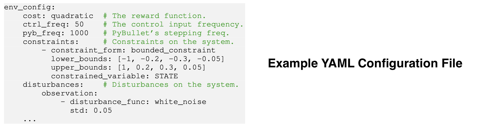

# safe-control-gym

Physics-based CartPole and Quadrotor [Gym](https://gym.openai.com) environments (using [PyBullet](https://pybullet.org/wordpress/)) with symbolic *a priori* dynamics (using [CasADi](https://web.casadi.org)) for **learning-based control**, and model-free and model-based **reinforcement learning** (RL).

These environments include (and evaluate) symbolic safety constraints and implement input, parameter, and dynamics disturbances to test the robustness and generalizability of control approaches. [[PDF]](https://arxiv.org/pdf/2108.06266.pdf)


```bibtex
@article{brunke2021safe,
         title={Safe Learning in Robotics: From Learning-Based Control to Safe Reinforcement Learning},
         author={Lukas Brunke and Melissa Greeff and Adam W. Hall and Zhaocong Yuan and Siqi Zhou and Jacopo Panerati and Angela P. Schoellig},
         journal = {Annual Review of Control, Robotics, and Autonomous Systems},
         year={2021},
         url = {https://arxiv.org/abs/2108.06266}}
```

To reproduce the results in the article, see [branch `ar`](https://github.com/utiasDSL/safe-control-gym/tree/ar).

```bibtex
@misc{yuan2021safecontrolgym,
      title={safe-control-gym: a Unified Benchmark Suite for Safe Learning-based Control and Reinforcement Learning},
      author={Zhaocong Yuan and Adam W. Hall and Siqi Zhou and Lukas Brunke and Melissa Greeff and Jacopo Panerati and Angela P. Schoellig},
      year={2021},
      eprint={2109.06325},
      archivePrefix={arXiv},
      primaryClass={cs.RO}}
```

To reproduce the results in the article, see [branch `submission`](https://github.com/utiasDSL/safe-control-gym/tree/submission).

<!--  -->

## Install on Ubuntu/macOS

### Clone repo

```bash
git clone https://github.com/utiasDSL/safe-control-gym.git
cd safe-control-gym
```

### Option A (recommended): using `conda`

Create and access a Python 3.10 environment using
[`conda`](https://docs.conda.io/projects/conda/en/latest/user-guide/install/index.html)

```bash
conda create -n safe python=3.10
conda activate safe
```

Install the `safe-control-gym` repository

```bash
pip install --upgrade pip
pip install -e .
```

### Option B: using venv and poetry

Create and access a Python 3.10 virtual environment using
[`pyenv`](https://github.com/pyenv/pyenv) and
[`venv`](https://docs.python.org/3/library/venv.html)

```bash
pyenv install 3.10
pyenv local 3.10
python3 -m venv safe
source safe/bin/activate
pip install --upgrade pip
pip install poetry
poetry install
```

#### Note

You may need to separately install `gmp`, a dependency of `pycddlib`:

 ```bash
conda install -c anaconda gmp
 ```

or

  ```bash
 sudo apt-get install libgmp-dev
 ```

## Architecture

Overview of [`safe-control-gym`](https://arxiv.org/abs/2109.06325)'s API:


## Configuration



## Performance

We compare the sample efficiency of `safe-control-gym` with the original [OpenAI Cartpole][001] and [PyBullet Gym's Inverted Pendulum][002], as well as [`gym-pybullet-drones`][003].
We choose the default physic simulation integration step of each project.
We report performance results for open-loop, random action inputs.
Note that the Bullet engine frequency reported for `safe-control-gym` is typically much finer grained for improved fidelity.
`safe-control-gym` quadrotor environment is not as light-weight as [`gym-pybullet-drones`][003] but provides the same order of magnitude speed-up and several more safety features/symbolic models.

| Environment                | GUI    | Control Freq.  | PyBullet Freq.  | Constraints & Disturbances^       | Speed-Up^^      |
| :------------------------: | :----: | :------------: | :-------------: | :-------------------------------: | :-------------: |
| [Gym cartpole][001]        | True   | 50Hz           | N/A             | No                                | 1.16x           |
| [InvPenPyBulletEnv][002]   | False  | 60Hz           | 60Hz            | No                                | 158.29x         |
| [cartpole][004]            | True   | 50Hz           | 50Hz            | No                                | 0.85x           |
| [cartpole][004]            | False  | 50Hz           | 1000Hz          | No                                | 24.73x          |
| [cartpole][004]            | False  | 50Hz           | 1000Hz          | Yes                               | 22.39x          |
| | | | | | |
| [gym-pyb-drones][003]      | True   | 48Hz           | 240Hz           | No                                | 2.43x           |
| [gym-pyb-drones][003]      | False  | 50Hz           | 1000Hz          | No                                | 21.50x          |
| [quadrotor][005]           | True   | 60Hz           | 240Hz           | No                                | 0.74x           |
| [quadrotor][005]           | False  | 50Hz           | 1000Hz          | No                                | 9.28x           |
| [quadrotor][005]           | False  | 50Hz           | 1000Hz          | Yes                               | 7.62x           |

> ^ Whether the environment includes a default set of constraints and disturbances
>
> ^^ Speed-up = Elapsed Simulation Time / Elapsed Wall Clock Time; on a 2.30GHz Quad-Core i7-1068NG7 with 32GB 3733MHz LPDDR4X; no GPU

[001]: https://github.com/openai/gym/blob/master/gym/envs/classic_control/cartpole.py
[002]: https://github.com/benelot/pybullet-gym/blob/master/pybulletgym/envs/mujoco/envs/pendulum/inverted_pendulum_env.py
[003]: https://github.com/utiasDSL/gym-pybullet-drones

[004]: https://github.com/utiasDSL/safe-control-gym/blob/main/safe_control_gym/envs/gym_control/cartpole.py
[005]: https://github.com/utiasDSL/safe-control-gym/blob/main/safe_control_gym/envs/gym_pybullet_drones/quadrotor.py

## Getting Started

Familiarize with APIs and environments with the scripts in [`examples/`](https://github.com/utiasDSL/safe-control-gym/tree/main/examples)

```bash
cd ./examples/                                                                    # Navigate to the examples folder
python3 pid/pid_experiment.py --algo pid --task quadrotor --overrides ./pid/config_overrides/quadrotor_3D/quadrotor_3D_tracking.yaml       # PID trajectory tracking with the 3D quadcopter
python3 no_controller/verbose_api.py --task cartpole --overrides no_controller/verbose_api.yaml               #  Printout of the extended safe-control-gym APIs
```

## Systems Variables and 2D Quadrotor Lemniscate Trajectory Tracking

 

## Verbose API Example


## List of Implemented Controllers

- [PID](https://github.com/utiasDSL/safe-control-gym/blob/main/safe_control_gym/controllers/pid/pid.py)
- [LQR](https://github.com/utiasDSL/safe-control-gym/blob/main/safe_control_gym/controllers/lqr/lqr.py)
- [iLQR](https://github.com/utiasDSL/safe-control-gym/blob/main/safe_control_gym/controllers/lqr/ilqr.py)
- [Linear MPC](https://github.com/utiasDSL/safe-control-gym/blob/main/safe_control_gym/controllers/mpc/linear_mpc.py)
- [GP-MPC](https://github.com/utiasDSL/safe-control-gym/blob/main/safe_control_gym/controllers/mpc/gp_mpc.py)
- [SAC](https://github.com/utiasDSL/safe-control-gym/blob/main/safe_control_gym/controllers/sac/sac.py)
- [PPO](https://github.com/utiasDSL/safe-control-gym/blob/main/safe_control_gym/controllers/ppo/ppo.py)
- [DDPG](https://github.com/utiasDSL/safe-control-gym/blob/main/safe_control_gym/controllers/ddpg/ddpg.py)
- [Safety Layer](https://github.com/utiasDSL/safe-control-gym/tree/main/safe_control_gym/controllers/safe_explorer)
- [RARL](https://github.com/utiasDSL/safe-control-gym/blob/main/safe_control_gym/controllers/rarl/rarl.py)
- [RAP](https://github.com/utiasDSL/safe-control-gym/blob/main/safe_control_gym/controllers/rarl/rap.py)

## List of Implemented Safety Filters

- [MPSC](https://github.com/utiasDSL/safe-control-gym/blob/main/safe_control_gym/safety_filters/mpsc/linear_mpsc.py)
- [CBF](https://github.com/utiasDSL/safe-control-gym/blob/main/safe_control_gym/safety_filters/cbf/cbf.py)
- [Neural Network CBF](https://github.com/utiasDSL/safe-control-gym/blob/main/safe_control_gym/safety_filters/cbf/cbf_nn.py)

## References

- Brunke, L., Greeff, M., Hall, A. W., Yuan, Z., Zhou, S., Panerati, J., & Schoellig, A. P. (2022). [Safe learning in robotics: From learning-based control to safe reinforcement learning](https://www.annualreviews.org/doi/abs/10.1146/annurev-control-042920-020211). Annual Review of Control, Robotics, and Autonomous Systems, 5, 411-444.
- Yuan, Z., Hall, A. W., Zhou, S., Brunke, L., Greeff, M., Panerati, J., & Schoellig, A. P. (2022). [safe-control-gym: A unified benchmark suite for safe learning-based control and reinforcement learning in robotics](https://ieeexplore.ieee.org/abstract/document/9849119). IEEE Robotics and Automation Letters, 7(4), 11142-11149.

## Related Open-source Projects

- [`gym-pybullet-drones`](https://github.com/utiasDSL/gym-pybullet-drones): single and multi-quadrotor environments
- [`stable-baselines3`](https://github.com/DLR-RM/stable-baselines3): PyTorch reinforcement learning algorithms
- [`bullet3`](https://github.com/bulletphysics/bullet3): multi-physics simulation engine
- [`gym`](https://github.com/openai/gym): OpenAI reinforcement learning toolkit
- [`casadi`](https://github.com/casadi/casadi): symbolic framework for numeric optimization
- [`safety-gym`](https://github.com/openai/safety-gym): environments for safe exploration in RL
- [`realworldrl_suite`](https://github.com/google-research/realworldrl_suite): real-world RL challenge framework
- [`gym-marl-reconnaissance`](https://github.com/JacopoPan/gym-marl-reconnaissance): multi-agent heterogeneous (UAV/UGV) environments

-----
> University of Toronto's [Dynamic Systems Lab](https://github.com/utiasDSL) / [Vector Institute for Artificial Intelligence](https://github.com/VectorInstitute)
